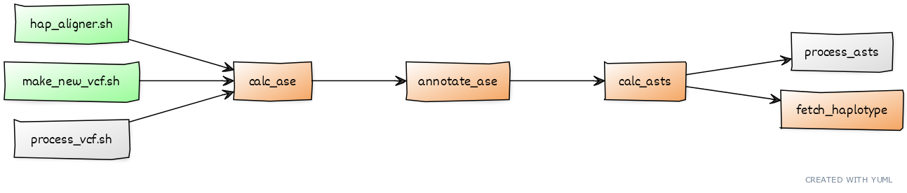

Command-Line Programs Listing
=============================

LoRALS includes several command-line programs with the module.
In addition, LoRALS also bundles helper shell scripts to assist in preparing inputs for LoRALS.
Linked below are the descriptions for each program along with format specifications for their inputs and outputs

Recommended workflow
--------------------

Command-Line Programs
---------------------

.. toctree::
    :maxdepth: 1
    :caption: Included command-line programs

    calc_ase
    annotate_ase
    calc_asts
    fetch_haplotype
    process_asts

.. toctree::
    :maxdepth: 1
    :caption: Bundled shell scripts
    :glob:

    *sh*
